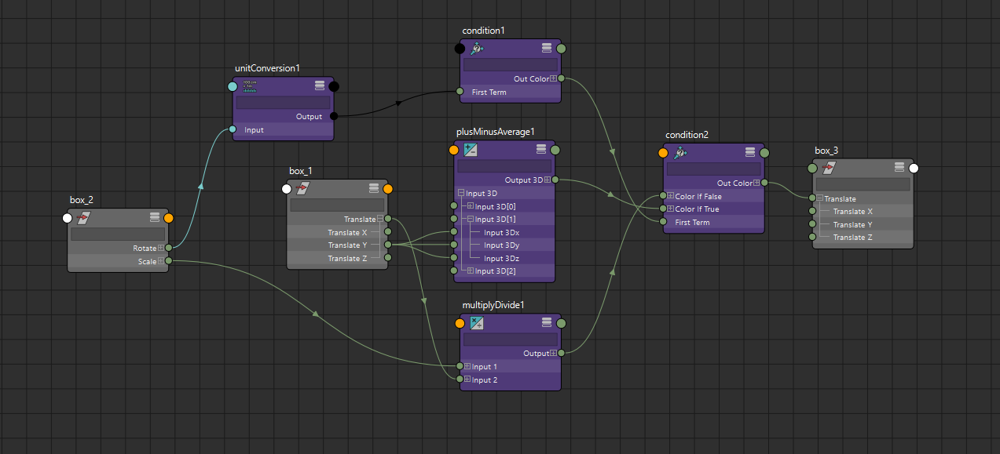
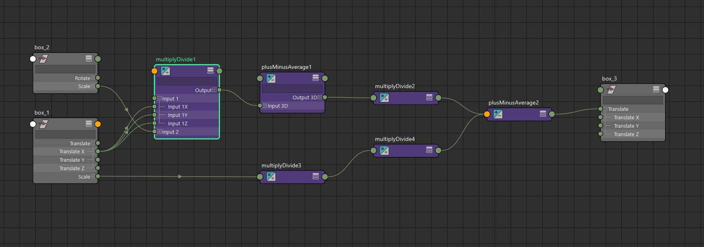
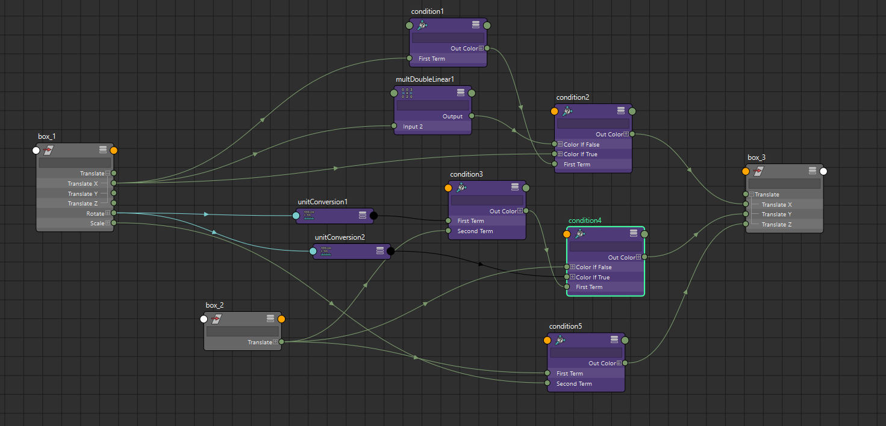

# Node-Calculator-Lark
Creates a graph of Autodesk Maya's nodes based on a string expression. Lark is used as a parser.

Inspired by [Chad Vernon's implementation](https://github.com/chadmv/cmt), I decided to make my own node calculator with blackjack and [Lark](https://github.com/lark-parser/lark).

## Install:

Enter the following code  in the Maya script editor:
```Python
import sys
path = 'your_path_to_Node_Calculator_Lark'
if not path in sys.path:
    sys.path.append(path) 

import nodeCulculator as n_calc
reload(n_calc)
```

## How to use:

In general terms, the expression will look like this:
```Python
n_calc.run_expr("box_3.t = box_1.tz + (box_2.r - (<7,7,7> + <2,4,2>)) + PI")
```

The expression consists of three parts: left value, assignment sign (=) and right value. 
Left value - can only have attribute name, like:
```
pCube1.ry, L_arm_ctrl.t
```

No expressions or constants on the left side of an expression will be accepted by the calculator.
There will only be __errors__.

The right value is an expression written in human readable style:

``` cross(box_1.t, <box_1.tx, 22, box_2.sz>, norm=1) ```

``` -box_1.ty + <1, 2, 3>  ```

``` box_2.rx > 4 ? <2,3,4> + box_1.ty : box_2.s * box_1.t ```

## Examples of use:

```Python
n_calc.run_expr("box_3.t = box_2.rx > 4 ? <2,3,4> + box_1.ty : box_2.s * box_1.t ")
```


```Python
n_calc.run_expr("box_3.t = (box_1.tx / box_2.s + <1,2,4>) / 5 + <3,5,7> * (2 / box_1.s)")
```


```Python
n_calc.run_expr("box_3.t = <abs(box_1.tx), min(box_1.ry, box_2.tz), box_2.tx >= box_1.sy>")
```


* * *

## Rules and properties:
### 1. The priority of operations execution is taken into account:
  - Functions: cross(), dot(), abs()...
  - Exponentiation:  ** (without a space in the middle) 
  - Unary operations: -, +
  - Parentheses: ()
  - *, /
  - +, -
  - Condition: ==, !=, >=, etc. 
  - Ternary operator: ? :

### 2. Constants:
  - **PI** - 3.14159265359
  - **E** - 2.718281828459
  - **true** - 1
  - **false** - 0

### 3. Types used:
  The calculator can use attributes and constant values - <ins>__scalars__</ins> and <ins>__vectors__</ins>.
  
  A scalar is a simple numeric value, or a one-component attribute:
  ```
  M_head_1_ctrl.ry  4  .73  M_root_offset_grp.sx  5.22
  ```
  
  Vector is a three-component value. And can be written as an attribute of vector type:
  ```
  L_arm_ctrl.t  M_root_ctrl.s  M_main_ctrl.r
  ```
  
  Or in the form of angle brackets: **< >**.

#### Examples:

 ``` <12, 4.7, PI> ```- simple vector value
 
 ``` <2, 4> -> <2, 4, 0 > ```- If you do not specify the third value, by default it will take the value zero.
 
 ``` <45> ```  - <ins>**error**</ins> - it's not allowed to write the vector that way.
  
  Vector can also be compound:
  
  ```<M_head_1_ctrl.ry, 43, L_bend_2_ctrl.tz>```
  
  In a compound vector, an attribute consisting of three components will be considered as an error.

  Also, the components of a vector can be an expression or a function result:
  
  ```<abs(box_1.tx), 11 ** 2, min(10, L_poleVec_ctrl.ty)>```


### 4. Functions:

  - Scalar only:

    - abs(x) - modulus of the value
    - min(x, y) - minimum of two values
    - max(x, y) - maximum of two values 	
    - sin(x [,degree=1]) - the sine of the value, by default, x takes a value in degrees. If the input value is given in radians, the flag should be set to zero: degree=0. 
    - cos(x[,degree=1]) - the same as sine, take the cosine value.
    
 - Only for vectors:
    
   - dot(x, y [,norm=0]) - dot product, the default result is not normalized. To normalize, set the flag **norm=1**.
   - cross(x, y [,norm=0]) - cross product, same as dot.
    
  #### Note: the list of functions will expand.


### 5. If the binary operation involves a <ins>__vector__</ins> and a <ins>__scalar__</ins>, the expression takes the form:

```<vec> op scalar == <vec[0] op scalar, vec[1] op scalar, vec[2] op scalar>```
	
Example: 
```
<M_head_1_ctrl.ry, 43, 22> + 33 == <M_head_1_ctrl.ry +33, 43 + 33, 22 + 33>
```

### 6. If the binary operation involves a <ins>__vector__</ins> and a <ins>__vector__</ins>, the expression takes the form

```<vec1> op <vec2> == <vec1[0] op vec2[0], vec1[1] op vec2[1], vec1[2] op vec2[2]>```
	
Example:
```
<M_head_1_ctrl.ry, 43, 22> / <71.3, box_1.sx> == <M_head_1_ctrl.ry / 71.3, 43 / box_1.sx, 22 / 0>
```

### TODO:
 - Implement the use of variables, like:
	 ```Python
	 n_calc.run_expr("x: = L_arm_3_ctrl.r ; M_main_motion_grp.t = x + <2, 4, 7>")
	 ```

 - Return a list of created nodes.
 - Functions: exp(), lerp(), sqrt(), norm(), clamp(), mod(), step(), foor(), cell(), smoothstep().
 - Logging.

